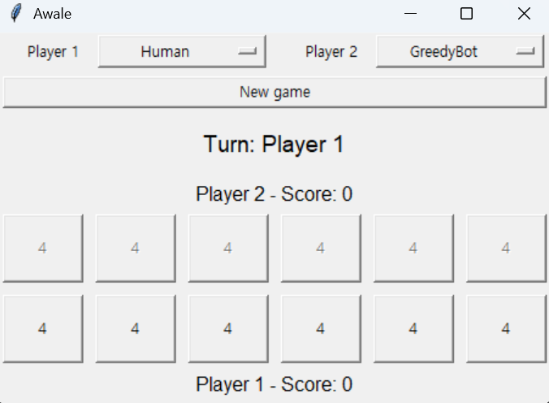

# Awale Project

Python implementation of the Awale game, following the object-oriented structure used in the Puissance 4 TP.

## Files

- `awale.py`: game model, board state, legal moves, sowing, capture rules, scores and heuristics.
- `players.py`: player classes: `Human`, `StupidBot`, `GreedyBot`, `MinMax`, `Sommet`, `MCTS`.
- `gui.py`: Tkinter graphical interface with player choices, bot-vs-bot mode and sowing animation.
- `main.py`: command-line entry point for GUI, console games and statistics.

## Run

Start the GUI:

```powershell
python main.py gui
```

Start the GUI against a specific bot:

```powershell
python main.py gui --opponent minmax
python main.py gui --opponent mcts
python main.py gui --opponent minmax --gui-minmax-heuristic mobility
```

Run one console game:

```powershell
python main.py game --player1 stupid --player2 greedy
python main.py game --player1 human --player2 minmax
```

Run statistics:

```powershell
python main.py stats --games-count 20
python main.py --minmax-depth 2 --mcts-iterations 100 stats --games-count 100
python main.py --minmax-heuristic mobility stats --games-count 20 --players mcts minmax
```

CLI note:

- statistics/global options are placed before the mode, for example `python main.py --minmax-heuristic mobility stats ...`;
- GUI-specific options are placed after `gui`, for example `python main.py gui --opponent minmax --gui-minmax-heuristic mobility`.

## Default Parameters

- Console/statistics MinMax depth: `2`
- Console/statistics MinMax heuristic: `score`
- GUI MinMax depth: `1`
- GUI MinMax heuristic: `score`
- Console/statistics MCTS iterations: `100`
- GUI MCTS iterations: `50`
- Maximum turns per automatic game: `300`

The turn limit avoids abnormally long automatic games. If the limit is reached, the current score determines the winner.

## Game End Conditions

The game ends when:

- one player has captured at least 25 seeds,
- the next player has no legal move.

When a player cannot move, the remaining seeds on the board are collected and added to the players' scores. The winner is the player with the highest score. In automatic console/statistics games, a maximum turn limit is also used to avoid abnormally long games.

## Implemented Players

- `Human`: chooses moves through console input or GUI clicks.
- `StupidBot`: chooses randomly among legal moves.
- `GreedyBot`: chooses the move with the best immediate capture.
- `MinMax`: uses MinMax with alpha-beta pruning and two heuristics.
- `MCTS`: uses Monte Carlo Tree Search with random simulations.

## MinMax Heuristics

- `heuristic_score`: evaluates the difference between captured seeds and remaining seeds.
- `heuristic_mobility`: evaluates score difference and legal move availability.

## MCTS

The MCTS implementation uses the following steps:

1. Selection with UCT.
2. Expansion of one unexplored move.
3. Random simulation until game end or turn limit.
4. Backpropagation of the result through the `Sommet` tree.

## GUI

The interface is built with Tkinter. It displays:

- the two rows of pits,
- current scores,
- current player,
- last played move,
- animated seed sowing,
- player selection for Human vs Bot or Bot vs Bot games,
- opponent bot selection, including both MinMax heuristics.

Example screenshot:



## Useful Checks

Compile the files:

```powershell
python -m py_compile awale.py players.py main.py gui.py
```

Quick statistics test:

```powershell
python main.py stats --games-count 2
```
